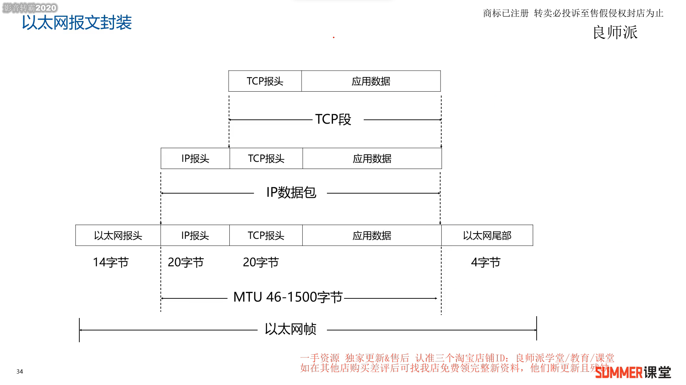

# 软考中级网络工程师

## 一、上午考点

* 计算机硬件基础：数据的表示、指令系统、流水线、CPU、Cache、内存编址、**存储设备**、可靠性

* 操作系统基础：**进程管理**、存储管理、文件管理、**设备管理**

* 系统开发与项目管理基础：软件生命周期、软件开发模型、**开发概念**、项目管理

* 知识产权和标准化：著作权、保护期限、产权人确立、侵权判断、商标权、专利权、**网络安全法**、信息安全法

* 网络体系结构：网络协议、网络性能参数、OSI参考模型、TCP/IP体系结构

* 数据通信基础：**信道传输速率**、**调制与编码**、常见复用技术和相关标准、差错控制编码（奇偶校验、海明校验、CRC校验）

* 广域网与接入网技术：HDLC、PPP、**SONET/SDH标准**、PON、xDSL、HFC、数据交换类型

* ***局域网技术***：IEEE 802标准、**以太网技术**、网桥、以太网交换机原理、**STP**、**无线局域网**、**VLAN**、**GVRP**、综合布线系统、**传输介质**

* 网络互联与因特网技术： IP地址、子网划分、CIDR、**IP数据报**、**ARP**、ICMP、**IPv6协议**、**TCP**、UDP、QOS、**路由基础概念**、路由器基本配置、**RIP**、**OSPF**、**IS-IS**、BGP、ACL、**NAT**、**Web**、**DNS**、**DHCP**、FTP、**Telnet**、**电子邮件**、**网络新技术**（区块链、大数据、云计算、SDN、5G）

* 系统与网络安全基础：计算机病毒、**网络攻击**、加密算法、密钥管理、数字签名、报文摘要、**数字证书**、入侵检测技术、入侵防御技术、**安全协议**、**认证技术**、VPN、防火墙、WAF、漏洞扫描设备、**等级保护**

* 网络管理技术：**Windows/Linux网管命令**、Linux系统命令、**Linux目录结构**、Linux配置文、**SNMP协议**、网络管理概念、RAID、**网络存储**、网络故障排除

* 网络规划和设计：**需求分析**、通信规范分析、逻辑网络设计、**物理网络设计**、**安装和维护**、网络测试

* 计算机专业英语

## 二、下午考点

* 网络系统分析与设计：对现有网络进行分析、网络拓扑设计、**地址规划**、**网络设备选择判断**、介质选择、**链路聚合**、**堆叠和级联**、网络测试、网络存储、RAID、网络管理命令、POE、**综合布线系统**
* 网络设备原理及配置：交换机基本原理和配置、**STP**、**VLAN**、静态路由、**RIP**、**OSPF**、BGP、**路由引入**、ACL、NAT、路由基本配置、路由器DHCP配置、三层交换机配置、IPV6、**WLAN**、广域网配置、策略路由、**VRRP**、**路由策略**
* 网络服务器的原理及配置：Windows 2008平台/Linux平台下的服务器基本配置、Web、FTP、DNS、DHCP服务的配置
* 网络安全原理及配置：**认证方式**、**IPSEC VPN**、防火墙配置和数据规划、病毒防治、**网络攻击防治**、网络安全防治

## 三、计算机网络概论

### 3.1 计算机网络发展与分类

* 发展：

  * 计算机网络：计算机技术与通信技术的结合 ICT = IT + CT

  * 1977年 OSI/RM参考模型 ISO制定

  * 1984年 TCP/IP正式标准 1985商用

* 分类1：通信子网和资源子网
  * 通信子网：通信节点（集线器、交换机、路由器等）和通信链路（电话线、同轴电缆、无线电线路、卫星线路、微波中继线路和光纤缆线）
  * 用户资源子网：PC、服务器等
* 分类2：网络拓扑结构
  * 星型网络、总线型网络、环形网络、树形网络、全网状型网络、不规则型网络
* 分类3：覆盖范围
  * 个域网PAN、局域网LAN、城域网MAN、广域网WAN

* 分类4：按照交换技术
  * 电路交换网络、报文交换网络、分组交换网络

### 3.2 OSI和TCP/IP参考模型

* **OSI**：
  * 应用层：各种应用程序、协议
  * 表示层：数据和信息的语法转换内码，数据**压缩解压、加密解密**
  * 会话层：为通信双方指定通信方式，并创建、注销会话
    * 前三层：HTTP.FTP.TFTP.DHCP.NTP.POP3.IMAP4.Telnet.SNMP.SMTP.DNS.LDAP.SSH
  * 传输层：提供可靠或者不可靠的**端到端传输**
    * TCP.UDP
  * 网络层：**逻辑寻址**；**路由选择**
    * IP.ICMP.ARP.RARP.OSPF.VRRP.IGMP.IS-IS.IPsec.BGP
  * 数据链路层：将分组封装成帧；提供**节点到节点的传输**；差错控制
  * 物理层：在媒介上传输比特流；提供机械和电气规约
    * PPP.PPTP.以太网

* TCP/IP参考模型
  * 应用层：Telnet/FTP/TFTP/SNMP/HTTP/SMTP/NFS/DHCP
  * 运输层：TCP，UDP
  * 网际层：ICMP，IP，Routing Protocol
  * 链路层：Ethernet，Frame-Relay， PPP/PPPOE ，HDLC
  * 物理层：双绞线，光纤/尾纤，配线架/理线架

### 3.3 数据封装与解封过程分析

* 各层的APDU

传输层  ---------------  数据段/报 Segment

网络层  --------------- 数据包/分组 Packet

数据链路层  ---------------  帧 Frame

物理层  ---------------  比特流 Bit

## 四、数据通信基础

### 4.1 信道特性

* 通信的目的就是传递信息
* 通信中产生和发送信息的一端叫信源，接受信息的一端叫信宿，信源和信宿之间的通信线路称为信道
* 信道带宽 W
  * 模拟信道：**W=f2 - f1** (f2、f1表示信道能通过的最高/最低频率，单位赫兹Hz)
  * 数字信道：数字信道是离散信道，带宽为信道能够达到的最大数据传输速率，单位是bit/s

* 码元：一个数字脉冲称为一个码元（时钟周期的信号）

* 码元速率：单位时间内信道传送的码元个数。如果码元宽度（脉冲周期）为T，则：

码元速率（波特率）为 **B =  1/T** ， 单位是波特  Baud

* 一个码元携带信息量 n（位）与码元种类数（N）的关系 **n = log2 N** 
* **奈奎斯特定理**：在一个理想的（**没有噪声环境**）信道中，若信道带宽为W，最大码元速率为： **B = 2 W**，极限数据速率为 **R = B log2 N = 2 W log2 N.** 

* QPSK情况下 N = 4，DPSK情况下 N = 2. 

* **香农定理**：在一个噪声信道的极限数据速率和带宽之间的关系。

极限速率公式为：**C = W log2（1 + S/N ）**

分贝和信噪比的关系： dB = 10 log10 S / N  ---------------- dB=10   S/N = 10   dB = 30 S/N = 1000

其中W为带宽，S为信号平均功率，N为噪声平均功率，S/N为信噪比。

### 4.2 信道延迟

* 信道延迟：与源端和宿端距离有关，也与信道中的信号传播速率有关 
* 总延时 = 线路延迟 + 发送延迟
  * **线路延迟 = 传输距离/传输速度**
  * **发送延迟= 数据帧大小/速率**
* 光速为300000km/s = 300 m/us
* 电缆中传播速度一般为光速67%，即200000km/s = 200 m/us
* 卫星信道的时延大约 270 ms (来回双向的延迟 540 ms)
* **信道延迟计算例题**
  * 在1000米100Base-T线路上，发送1000字节数据，延时计算过程如下：
    * 换算单位：100Base-T线路带宽是100M，即100Mbit/s = 100 × 106 bit/s，1000字节 = 1000 ×8bit
    * 传输延迟(线路)：1000m / (200000km/s) = 5×10-6 s = 5 us
    * 发送延迟(网络)：1000×8bit / (100×106 bit/s) = 8×10-5 s = 80 us
    * 数据延迟 = 发送延迟 + 传输延迟 = 80us + 5us = 85us

### 4.3 传输介质

两个终端，用一条能承载数据传输的传输介质连接起来，就组成了一个最简单的网络。

* 有线传输介质主要有同轴电缆、双绞线和光纤
  * 双绞线由多对绝缘铜导线两两相互缠绕而成，目的是为了降低信号干扰的程度。  8芯  --> 4对
    * 网线只能传100米
    * 非屏蔽双绞线（UTP）和屏蔽双绞线（STP）
  * TIA/EIA:电信工业协会/电子工业协会
  * 光纤：利用光在玻璃或塑料纤维中的全反射原理而达成的光传导工具，重量轻，体积小，传输远，衰减小，容量大，抗电磁干扰
    * 单模光纤运行波长1310nm或1550nm ---大容量长距离10 40 100km --- 黄色 LX/LH/ZX  --- 直线传播
    * 多模光纤运行波长850nm或1300nm  ---- 小容量短距离 500m --- 橘黄色或浅绿 SX  --- 反射传播
  * 跳线与尾纤
    * 双绞线跳线：带水晶头的网线
    * 光纤跳线：带有连接器与保护层的光纤
    * 尾纤：只有一头有光纤接口
* 无线传输介质分为**无线电波（500kHz-1000MHz）**、**微波(300Mhz-300GHz)**、红外线、激光
  * 无线电波主要用于广播电视和无线通信，特点是能量最小，波长最高，频率最低的电磁波；微波主要用于雷达、飞机导航，特点是波长较低，高频高能量。

### 4.4 数据编码

* 曼彻斯特编码
  * 曼彻斯特编码是一种双相码，在每个比特中间均有一个跳变，第一个编码自定义，常用于以太网中

* 差分曼彻斯特编码

* 两种曼彻斯特编码特点：
  * 曼码和差分曼码是典型的双相码，双相码要求每一位都有一个电平转换，一高一低，必须翻转
  * 曼码和差分曼码具有**自定时**和**检测错误**的功能
  * 两种曼彻斯特编码的优点：将时钟和数据包含在信号数据流中，也称**自同步码**
  * 编码效率低：编码效率都是50%
  * 两种曼码**数据速率是码元速率的一半**，当数据传输速率为100Mbps时，码元速率为200M baud。

* 其他编码
  * 4B/5B：发送数据流每4bits，先转换成5bit，再转换为**不归零码（NRZ-I）**，多1位用于解决同步问题。
  * 各种编码效率
    * 曼彻斯特编码效率 50%，用于以太网
    * 4B/5B效率80%，用于百兆以太网
    * 8B/10B效率80%，用于千兆以太网
    * 64B/66B效率97%，用于万兆以太网

### 4.5 数字调制技术

* 数字数据不仅可以用脉冲传输，也可以用模拟信号传输。用数字数据调制模拟信号叫做数字调制
  * 幅度键控（ASK）：用载波的两个不同振幅表示0和1 -- 高低
  * 频移键控（FSK）：用载波的两个不同频率表示0和1 -- 快慢
  * 相移键控（PSK）：用载波的起始相位的变化表示0和1 -- 形状
* 码元只取两个相位叫2相调制，码元可取4个相位叫4相调制，则N=2，N=4
* DPSK是2相调制，N = 2，QPSK是4相调制，N = 4 

### 4.6 脉码调制PCM

* 常用数字化技术就是脉冲编码调制技术(Pulse Code Modulation,PCM)，简称脉码调制
* PCM数字化过程3个步骤：采样、量化、编码
  * 采样：按照一定的时间间隔对模拟信号进行取样，把模拟信号的当前值作为样本。
    * 奈奎斯特采样定理：如果模拟信号的最高频率为fmax，若以大于等于2fmax的采样频率对其进行采样，则采样得到的离散信号序列就能完整的恢复出原始信号    f = 1/T >= 2fmax
  * 量化：把取样后得到的样本由连续值转换为离散值，离散值的个数决定了量化的精度
  * 编码：把量化后的样本值变成相应的二进制代码

* 【重点理解】对声音信号数字化时，由于语音最高频率是4kHz,所以取样频率是8kHz。对语音样本用128个等级量化，因而每个样本用7bit表示。-----  7 = log2 128  --- 所以速率为7*8000 = 56 Kbps

### 4.7 数据通信方式

* 按通信方向分
  * 单工：信息只能从一个方向传送，发送方不能接受，接收方不能发送（电视/广播）
  * 半双工通信：通信的双方可以交替发送和接受信息，但不能同时接收或发送（对讲机/Wi-Fi/**Hub**）
  * 全双工通信：通信的双方可同时进行双向的信息传送（电话/**交换机**）
* 按照同步方式分
  * 两种传输方式：同步传输和异步传输
    * 异步传输：把各个字符分开传输，**HDLC**是典型的异步传输，起始和结束标志位都是 **01111110**
    * 同步传输：同步传输效率更高，短距离高速数据传输

### 4.8 数据交换方式

数据交换技术有3种：电路交换、报文交换和分组交换

* 电路交换：将数据传输分为电路建立、数据传输和电路拆除3个过程。在数据传送之前需建立一条物理通路，在该线路被释放之前，该通路将一直被用户完全占有【早期电话】
* 报文交换：报文从发送方传送到接收方采用**存储转发**的方式。报文中含有每一个下一跳节点，**完整的报文**在一个个节点间传送（数据不拆分）【早期电报】
* 分组交换：将数据拆分成很小的分组进行传送，包括：数据报和虚电路【互联网】
  * 数据报：每个分组被独立地处理，每个节点根据路由选择算法，被独立送到目的，路径和到达目的的顺序都可能不一样
  * 虚电路：在数据传送之前，先建立一个条逻辑上的连接，每个分组都沿着一条路径传输，不会乱序

* 分组交换的优势
  * 减少了延迟，提高了吞吐量
  * 分组交换可以按分组纠错，发现错误只需重发出错的分组，通信效率提高

### 4.9 数字传输系统E1/T1

* 多路复用技术是把多个低速的信道组合成一个高速的信道的技术
  * 多路复用器(OLT)和多路分配器(ONU光猫)
* 光纤入户：上网、电视、电话
* 频分复用的应用：无线电广播、ADSL、FDD-LTE
* 时分多路复用：T1/E1、SONET/SDH、WIFI、TDD-LTE、PSTN
  * STM-1  155Mbps
  * STM-4  622Mbps
  * STM-16  2.5Gbps
  * STM-64  10Gbps
  * 美国和日本使用T1标准，每路电话64k **T1 = 1.544M**
  * 中国和欧洲采用E1标准，   **E1 = 2.048M ** 传送时间124us
* 波分复用：本质也是频分复用  光速 C = 波长 × 频率

### 4.10 海明码纠错码

* 差错控制：数据通信中常用的办法是检错和纠错

  * 检错：接收方知道有差错发生，但不知道是怎样的差错，向发送方请求重传
  * 纠错：接收方知道有差错发生，而且知道是怎样的差错
  * 原理：传输k位，加入r位冗余

* **奇偶校验**是最常用的检错方法，能检出一位错位

  * 原理：在7位ASCII码后增加以为，使码字中1的个数成奇数（奇校验）或偶数（偶校验） 

* 海明(Hamming)码是通冗余数据位来检测和纠正差错的编码方式

  * 在数据中间加入几个校验码，码距均匀拉大，当某一位出错，会引起几个校验位的值发生变化

  * 海明不等式 
    $$
    2^k-1   \ge  m+k
    $$

  * m为信息位，m+k为编码后的总长度，k是检验码的个数

* 海明距离（码距）：两个码字之间不同的比特数  1011 01 00 和 1011 01 11，码距是2
* 海明码编码
  * 第 2i（i=0, 1, 2, ··）位是校验位，其余位存放数据 1 2 4 8 16 32 64
  * 假设传送信息 1001011，要把数据放在3，5，6，7，9，10，11上

  	  ​      1	  	0	0	1	  	 0	 1	  1

**1**	**2**	3	**4**	5	6	7	**8**	9	10	11

校验位与数据位的关系 16 8 4 2 1 拆分组成位置号，也就是2的次方和

3 = 2+1    5 =4+1   6=4+2   7=4+2+1   9=8+1   10=8+2   11= 8+2+1

第一位数据位由包含1的数据号对应的数据产生

例如： 1上的校验应由3，5，7，9，11号位参加，若按偶校验进行计算，1号位应位1。因为  1 0 1 0 1 ，偶校验还差一个1。

2的校验位由3，6，7，10，11对应的1  0  1  1  1 产生，所以应该是 0

### 4.11 CRC循环冗余码

* 末尾加入CRC循环冗余校验码能检错不能纠错，广泛用于网络通信和磁盘存储
* 采用CRC进行差错校验，生成多项式为，信息码字为10111，则计算出CRC校验码是（**D**）

$$
G(X)=X^4+X+1
$$

​	A. 0000			 B. 0100			 C. 0010			 D. 1100

 1.判断校验位数：生成多项式的最高次方是几，校验位就是几位 --- X4  就是4位校验位

2.补齐数据位后面的0    --- 10111   **0000**

3.提取生成多项式的系数  **1***X^4 + **0***X^3 +  **0***X^2 + **1***X^1 + **1***X^0 ---  10011

4.用第二步的结果，与第三步的结果进行异或运算，余数就是CRC校验码，余数不够位就在前面补0

### 4.12 章节总结

* 奈奎斯特定理：B=2W  R=Blog2 N，N取决于调制技术
* 香农定理：C = W log2（1 + S/N ）C = W log2（1 + S/N ）
* 信道延迟：发送数据总时间=线路延迟+调制延迟
* 线路延迟=传输距离/传播速度  发送延迟=数据帧大小/信道速率
* 光纤与光缆：单模光纤和多模光纤（传输模式、光源、距离、成本）
* 数据编码：曼彻斯特编码和差分曼彻斯特编码
* 调制技术：ASK、FSK、PSK、QAM、DPSK、QPSK
* 脉冲编码调制PCM：采样频率大于等于 **2fmax**
* 量化等级为N，每个样本携带log2 N 比特位
* 同步传输/异步传输，三种交换方式概念
* T1和E1载波：T1=1.544Mbps，E1=2.048Mbps
* 光纤多路复用OC-1=51.84Mbps，STM-1=OC-3=155Mbps
* 奇偶校验、海明码和CRC循环冗余校验码原理和计算

## 五、广域通信网

### 5.1 广域网物理层特性

* 公共交换电话网（Public Switched Telephone Network,PSTN）是为了语音通信而建立的网络，从20世纪60年代开始又被用于数据传输
  * 电话网由3个部分组成：本地回路、干线、交换机
  * 干线和交换机一般采用数字传输和交换技术，而本地回路基本采用模拟线路
* 本地回路
  * DTE 数据终端设备，这种设备代表通信链路的端点
  * DCE 数据电路设备，用于信号变换器、自动呼叫等
* 机械特性
  * RS-232-C  -- 25针D型连接器、微型机串口9针
  * V.28标准电路，速率20kb/s，最长15m
  * 3-15V表示1，-3 - -15V表示0

### 5.2 流量与差错控制

* 流量控制：协调发送站和接收站工作步调，避免发送速度过快，接收站处理不过来

  * 停等协议： 发送站发一帧，收到应答信号（ACK 64B）后再发送下一帧，如果接收站不应答，发送站必须等待
  * 滑动窗口协议：允许连续发送多个帧而无须等待应答 

  * 差错控制：检错和纠正传输错误的机制
    * 停等ARQ协议是停等流控技术和自动请求重发技术的结合
    * 发送站发送出一帧后必须等待应答信号，收到肯定应答信号ACK后继续发送下一帧，收到否定应答信号NAK后重发该帧，若在一定的时间内没有收到应答信号也必须重发
    * 选择重发ARQ协议 vs 后退N帧ARQ协议

### 5.3 帧中继和HDLC

* 帧中继FR(Frame Relay) 在第二层建立虚电路，提供虚电路服务，本地标识DLCI

  * 基于分组交换的透明传输，可提供面向连接的服务
  * 只做**检错和拥塞控制**，没有流控和重传机制，开销很少
  * 既可以按需要提供带宽，也可以应对突发的数据传输  CIR 承诺速率  EIR 扩展速率
  * 帧长可变，长度可达1600-4096字节，可以承载各种局域网的数据帧
  * 可以达到很高的速率 2-45Mbps
  * 不适用对延迟敏感的应用（语音、视频）
  * 数据的丢失依赖于运营商对虚电路的配置
  * 不保障可靠的提交 -- UDP
  * ISDN（BRI=144kbps/PRI=2048kbps）和ATM
* HDLC（High Level Data Link Control,高级数据链路控制协议）
  * HDLC 是一种**面向位（比特）的同步链路控制协议**
  * 通常使用CRC-16、CRC-32校验，帧边界 “ 01111110 ”  8位
  * 帧头F8 -- 地址A8 -- 控制C8 -- 数据INFO可变长 -- 校验FCS16或32 -- 帧尾F8
* HDLC帧格式及控制字段
  * 01111110  地址   控制字段  DATA  FCS  01111110
  * 控制字段包括：I帧，S帧，U帧，共1字节，8bits
  * 信息帧（I帧）：第一位为0，用来承载数据和控制，N(S)/N(R)取值范围是0~7
  * 监控帧（S帧）：用于差错控制和流量控制
  * 无编号帧（U帧）：用于提供对链路的建立，拆除以及多种控制功能，有时也可以承载数据
* 记忆符  --  名称  --  S字段  --  功能
  * RR -- 接受准备好 -- 0/0 -- 确认，且准备好接受下一帧，已收妥N(R)以前的各帧
  * RNR -- 接受未准备好 -- 1/0 -- 确认，暂停接受下一帧，已收妥N(R)以前的各帧
  * REJ -- 拒绝接受 -- 0/1 -- 否认，否认N(R)起的各帧，但N(R)以前的帧已收妥
  * SREJ -- 选择拒绝接受 -- 1/1 -- 否认，只否认序号为N(R)的帧

## 六、局域网和城域网

### 6.1 局域网基础

* 局域网和城域网体系架构 IEEE -- 主要负责链路层的协议标准指定，IETF -- 主要负责网络层的标准制定
* 局域网拓扑结构
  * 星型，总线型，环型和混合型

### 6.2 CSMA/CD

对总线型、星型和树形拓扑访问控制协议是CSMA/CD(Carrier Sense Multiple Access/Collision Detection,载波侦听多路访问/冲突检测)

* 基本原理：发送数据之前，先监听信道上是否有人在发送，若有，说明信道正忙，否则说明信道是空闲的；若信道是空闲的，是否立即发送，若是忙，是否继续监听，若连续**16次**碰撞，则认为网络繁忙或故障，不再尝试发送
* 三种监听算法
  * 非坚持型监听算法：后退随机事件
  * 1-坚持型监听算法：继续监听，不等待
  * P-坚持型监听算法
* 冲突检测原理：载波监听只能**减小冲突的概率，不能完全避免冲突**，边发边听的冲突检测方法
  * 发送期间同时接受，并把接收的数据与站中存储的数据进行比较
  * 若比较结果一致，说明没有冲突，重复上一步
  * 若比较结果不一致，说明发生了冲突，立即停止发送，并发送一个简短的干扰信号（Jamming)
  * 发送Jamming信号后，等待一段随机长的时间，重新监听，再试着发送

### 6.3 二进制指数退避算法

重传次数越多，退避窗口（Random值）越大，从而降低冲突概率

T * Random[0,1, ... ,2k-1 ] ,  k = [重传次数,10]

### 6.4 最小帧长计算

**Lmin = 2R * d / v**

R为网络数据速率，d为最大距离，v为传播速度

### 6.5 以太网帧与物理层规范

先导字段10101010 -- 7字节

帧开始标识10101011 -- 1字节

目的地址 -- 6字节  源地址 -- 6字节  长度 -- 2字节   数据 46~1500字节   校验和(FCS)4字节

* 以太网帧结构
  * 前面7+1字节用于时钟同步，不算入帧长
  * 数据46-1500字节，不够至少填充到46字节
  * 校验位4字节，CRC循环冗余校验32位
  * **最小帧长64字节，最大帧长1518字节**

* 以太网报文封装

* 802.3以太网（10M）  
  * 物理介质命名规范  <传输速率Mbps><信号方式><最大传输距离（百米）或介质类型>
  * 100BASE**T** --->  T表示双绞线，F表示光纤，如果有5表示500米
* 快速以太网802.3u（100M）
  * 100Base-TX --- 两对5类UTP(非屏蔽双绞线) + 两对STP(屏蔽双绞线)
  * 100Base-FX --- 一对多模光纤MMF + 一对单模光纤SMF
  * 100Base-T4 --- 四对3类UTP
  * 100Base-T2 --- 两对3类UTP
* 千兆以太网（1000M）
  * 两个标准802.3z和802.3ab(1000BASE-T)，千兆需要4对双绞线，达到100米传输
  * 1000BASE-LX标准可以使用单模和多模光纤传输
  * IEEE 802.3z    1000BASE-SX     光纤短波(850nm)    550m     多模光纤
  * IEEE 802.3z    1000BASE-LX     光纤长波(1310/1550nm)    5000m   单模(10 um)或多模光纤
  * IEEE 802.3z    1000BASE-CX     两对STP    25m        屏蔽双绞线
  * IEEE 802.3ab    1000BASE-T     四对UTP    100m      5类非屏蔽双绞线--8B/10B编码
* 万兆以太网802.3ae（10G）
  * 10GBase-S	 50um多模/62.5um多模    300/65m      850nm串行
  * 10GBase-L	 单模光纤                              10km            1310nm串行
  * 10GBase-E         单模光纤                              40km            1550nm串行
  * 10GBase-LX4      单/50um多/62.5um多     10km/300m/300m   1310nm

### 6.6 虚拟局域网VLAN

* 虚拟局域网（Virtual Local Area Network,VLAN）
  * 根据管理功能、组织机构或应用类型对交换局域网进行分段而形成的逻辑网络
  * 不同VLAN通信必须经过三层设备：路由器、三层交换机、防火墙
  * 虚拟局域网工作站可以不属于同一物理网段，任何交换端口都可以分配给某个VLAN，属于同一VLAN的所有端口构成一个广播域
  * 冲突域和广播域，一个中继器和集线器是一个冲突域，交换机的一个接口为一个冲突域，一个VLAN/路由器为一个广播域，
  * 冲突域：是指连接在同一共享介质上的所有节点的集合，冲突域内所有节点竞争同一带宽，一个节点发出的报文，其余节点都可以收到
  * 广播域：广播报文能到达的整个访问范围称为二层广播域，简称广播域，同一广播域内的主机都能收到广播报文
* 交换机VLAN划分
  * 静态划分VLAN：基于交换机端口
  * 动态划分VLAN：基于MAC地址、基于策略、基于网络层协议、基于网络层地址
* VLAN划分配置

* VLAN作用

  * 控制网络流量。一个VLAN内部的通信（包括广播通信）不会转发到其他VLAN中去，从而有助于控制广播风暴，**减少冲突域，提高网络带宽的利用率**
  * 提高网络的安全性。可以通过配置VLAN之间的路由来提供广播过滤，安全和流量控制等功能。不同VLAN之间的通信收到限制，**提高了企业网络的安全性**。
  * 灵活的网络管理。VLAN机制使得工作组**可以突破地理位置的限制而根据管理功能来划分**。如果根据MAC地址划分VLAN，用户可以在任何地方接入交换网络，实现**移动办公**

* 802.1Q标签（重点掌握PRI和VID）

* 目的地址 -- 6字节  源地址 -- 6字节 

  插入802.1Q标签  ----   4字节
  类型/长度 -- 2字节   数据 46~1500字节   校验和(FCS)4字节

  * 802.1Q帧格式  TPID--16b   PRI--3b  CFI--1b  VID--12b
  * PRI（3位）：Priority表示优先级，提供0~7共8个优先级，当有多个帧等待发送时，按优先级顺序发送数据包
  * VID（12位）：VLAN标识符，最多可以表示212=4096个VLAN，其中VID 0用于识别优先级，VID 4095保留未用，所以最多可配置**4094**个VLAN。默认管理VLAN是1，不能删除。
  * 交换机添加和删除 VLAN标签的过程由专用硬件自动实现，处理速度很快，不会引入太大的延迟。VLAN标记对用户是透明的

### 6.7 生成树协议STP

交换机单链路上行，存在单点故障---->采用冗余拓扑解决 ---->  带来了新的问题：二层环路   ------>   二层环路会造成广播风暴和MAC表震荡

* 生成树（Spanning-tree,STP）技术，能够在网络中存在二层环路时，通过逻辑阻塞（Block）特定端口，从而打破环路，并且在网络出现拓扑变更时及时收敛，保障网络冗余性

### 6.8 城域网基础
